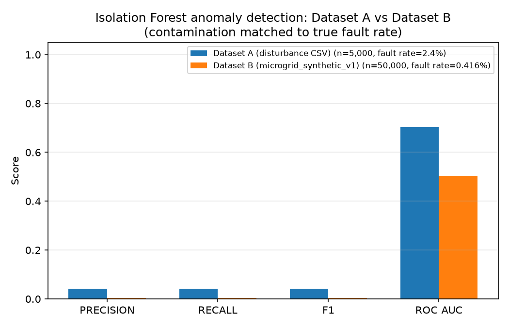
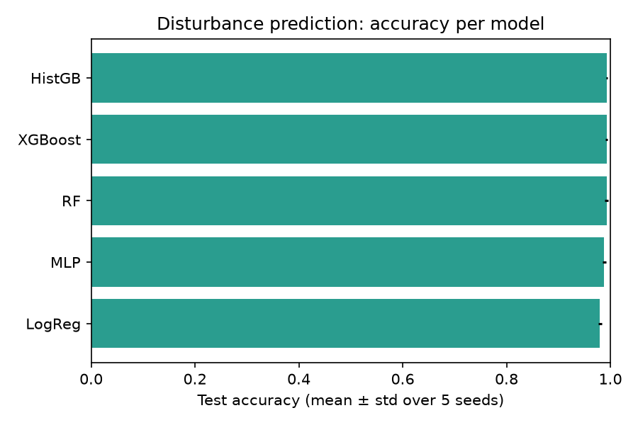
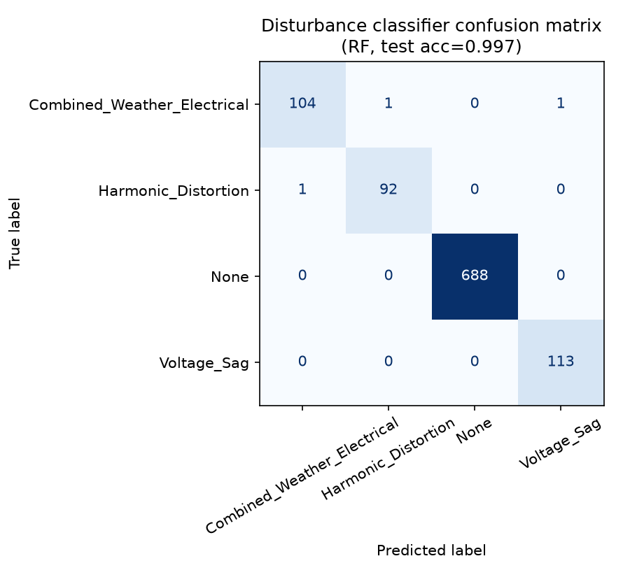
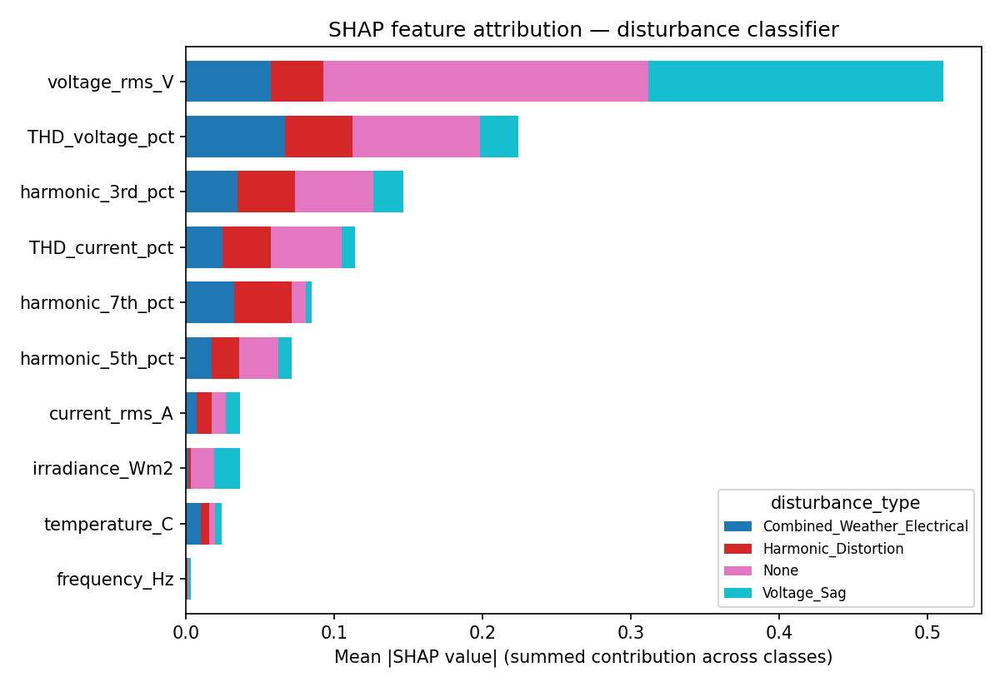
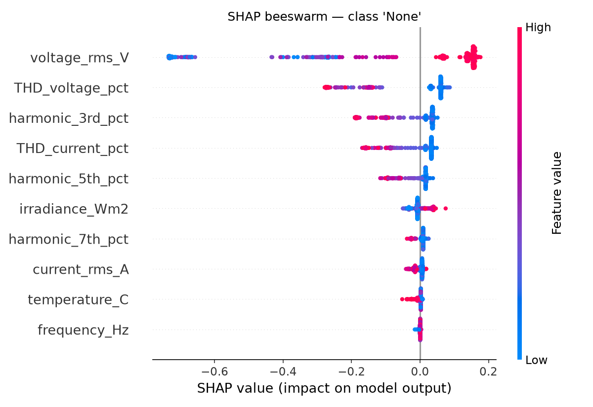

# CSE-Side Work Summary — Microgrid Digital Twin Project

This is a CSE-only walkthrough of the repo — everything the CSE side
owns, in one place, without needing to read the full project README.
For the EEE side's Simulink work, see the main
[`README.md`](../README.md) Part 5 instead.

Three datasets are involved across the CSE side's work. This doc
covers all of them, with a dedicated section explaining exactly what
was done with the two that were directly compared against each other.

---

## 1. UCI Grid Stability pipeline (public benchmark)

A public, peer-reviewed 10,000-row benchmark (Schafer et al. 2016) —
not something built in-house, used as the credibility foundation.

**Files:** [`src/eda.py`](../src/eda.py),
[`src/baselines.py`](../src/baselines.py),
[`src/significance.py`](../src/significance.py),
[`src/robustness.py`](../src/robustness.py)

5 classifiers × 5 seeds each:

| Model | Accuracy | Macro-F1 |
|---|---:|---:|
| **MLP** | **96.05% ± 0.62%** | 95.72% |
| HistGB | 94.72% | 94.24% |
| XGBoost | 94.39% | 93.87% |
| RF | 92.16% | 91.38% |
| LogReg | 81.50% | 79.58% |

The novel contribution here is the **tau-robustness margin** — for
every correctly-classified point, how much consumer reaction-time
perturbation it takes to flip the prediction. Finding: the most
accurate model (MLP) is *not* the most robust — Logistic Regression,
despite lowest accuracy, has the largest safety margin. Full detail in
the main README, Part 1.

---

## 2. Synthetic Bangladesh microgrid dataset + downstream pipelines

**File:** [`src/generate_synthetic_dataset.py`](../src/generate_synthetic_dataset.py)
→ [`data/synthetic/microgrid_synthetic_v1.csv`](../data/synthetic/)
50,000 rows × 50 columns, physics-informed (PV depends on irradiance +
derated cell temperature, wind follows a cube law, THD responds to RE
penetration/nonlinear load/ESS/AI-control, etc.), across 10 operating
scenarios. Built because no single real dataset had voltage, current,
THD, frequency, battery state, and a time axis all in one place.
**Watermarked** (`source = "SYNTHETIC_GENERATOR_v1"`) so it can never
be mistaken for real evidence.

**IEEE 519 compliance classifier** —
[`src/compliance_classifier.py`](../src/compliance_classifier.py),
predicts PASS/MARGINAL/FAIL *without* using THD/harmonics as features
(those define the label, so including them would be trivial):

| Model | Accuracy | Macro-F1 | FAIL-F1 |
|---|---:|---:|---:|
| **XGBoost** | **99.82%** | 99.55% | 99.28% |
| RF | 99.81% | 99.41% | 98.86% |
| HistGB | 99.79% | 99.36% | 98.79% |

Honestly flagged in the README as too clean to be believable — the
generator's physics is clean enough that indirect features still
reconstruct THD almost perfectly. Real Simulink output is expected to
land at 85–92%, which will read better in a paper.

**Multi-horizon THD forecasting** —
[`src/forecasting.py`](../src/forecasting.py), LSTM/GRU/MLP predicting
V-THD 5/15/30 minutes ahead, chronological split:

| Model | Horizon | RMSE | R² |
|---|---:|---:|---:|
| Persistence (baseline) | 5 min | 1.50 | -0.67 |
| **LSTM** | 5 min | **1.06** | **+0.16** |

All three deep models beat persistence by ~30% on RMSE — real signal
extracted. Honest weakness: early-warning F1 for predicting an actual
threshold breach collapses to 0, since breaches are only 2% of rows
and MSE loss teaches the model to hug the mean. Flagged as a known
limitation, not hidden.

---

## 3. Power-quality disturbance dataset — cyber-resilience, prediction, explainability, dashboard

This is today's work: the proposal's Modules 3, 4, 5, and 7.

**File:** [`data/external/microgrid_power_quality_dataset.csv`](../data/external/)
— 5,000 rows, field-measured at the **Jamalpur powerplant site**
(confirmed by the team member who provided it — see
[`docs/DATA_PROVENANCE_AND_QUALITY.md`](DATA_PROVENANCE_AND_QUALITY.md)
for the full investigation and what's measured vs. team-calculated
column by column).

### Anomaly detection (Module 3) — [`src/anomaly_detection.py`](../src/anomaly_detection.py)

Isolation Forest, unsupervised (never sees `sensor_fault_flag` during
training):

Then added 5-fold cross-validated threshold tuning on top of the raw
score — separating "is the ranking any good" (ROC-AUC) from "did we
pick a good cutoff" (precision/recall/F1):

| Dataset | ROC-AUC | Default threshold F1 | CV-tuned threshold F1 | Oracle ceiling |
|---|---:|---:|---:|---:|
| Disturbance dataset | 0.70 | 0.066 | **0.105** | 0.106 |
| Synthetic microgrid dataset | 0.50 | 0.011 | 0.012 | 0.016 |

Tuning nearly closed the entire gap to the oracle ceiling on the
disturbance dataset — the bottleneck was threshold selection, not the
underlying ranking.

**Supervised comparison** —
[`src/supervised_fault_check.py`](../src/supervised_fault_check.py)
trains a classifier *with* label access, to see how much of the gap
above is "no signal" vs. "unsupervised can't find it":

| Method | Precision | Recall | F1 | ROC-AUC |
|---|---:|---:|---:|---:|
| Supervised RF (uses labels) | 1.00 | 0.46 | 0.63 | 0.82 |
| Unsupervised (CV-tuned) | 0.057 | 0.64 | 0.105 | 0.70 |

Reading: the fault signal *is* there, it's just not shaped like a
natural multivariate outlier — a real methodological finding, not a
failure.

### Disturbance prediction (Module 4) — [`src/disturbance_classifier.py`](../src/disturbance_classifier.py)

4-class prediction (None / Voltage_Sag / Harmonic_Distortion /
Combined_Weather_Electrical) from electrical + weather features, 5
models × 5 seeds:

Best (RF, saved model): **99.70% test accuracy**. Real bug caught and
fixed along the way — pandas silently reads the literal string
`"None"` as a missing value by default, which was corrupting the
labels until an explicit `fillna("None")` was added.

### Explainability (Module 5) — [`src/explainability.py`](../src/explainability.py)

SHAP on the trained classifier — confirms the model's decision logic
is physically sensible, not a black box making lucky guesses:

`voltage_rms_V` dominates Voltage_Sag predictions; `THD_voltage_pct`
and harmonic terms dominate Harmonic_Distortion — exactly what a power
engineer would expect. Per-class direction of effect:

### Dashboard (Module 7) — [`src/dashboard.py`](../src/dashboard.py)

`streamlit run src/dashboard.py` — ties the three pieces above into
one interactive view: pick a row, see the live reading, get a plain
alert banner from both the disturbance classifier and the anomaly
detector, see a live SHAP explanation for that specific row (not just
an aggregate plot), and see the cost impact — explicitly labelled
team-calculated rather than presented as ground truth (see the
dataset section below for why).

---

## What was done with the two main datasets — the highlight

You have two datasets that are structurally very different: the
**disturbance dataset** (5,000 rows, single-phase, 16 columns, field
data from Jamalpur) and the **synthetic microgrid dataset** (50,000
rows, three-phase, 50 columns, physics-informed generator). Different
column schemas, different scale, different purpose — they can't be
concatenated into one training table without inventing a mapping
between incompatible feature sets, so **the decision was to compare
them side by side on the same technique, not force a merge.**

Concretely, `anomaly_detection.py` runs the exact same Isolation
Forest recipe on both, independently, and reports both results in the
same table (shown above). That comparison is what surfaced the
clearest finding in this whole section: the synthetic dataset's
`fault_flag` is generated as pure random noise in its own generator
script (`rng.random(n) < 0.005`, by design, uncorrelated with any
feature) — so a chance-level 0.50 ROC-AUC there is the *correct*
result, not a bug. Running the same method on the disturbance dataset
and getting a real 0.70 ROC-AUC alongside that null result is what
confirms the anomaly detector is doing real work on real data, rather
than just producing a number that looks plausible on its own.

That comparison also directly answered a live question earlier in
this project: whether the disturbance dataset's near-perfect
separability (the 99.7% disturbance-prediction accuracy, the 1.00
precision supervised fault detector) was a red flag. Running the
identical pipeline against a dataset with a *known* null relationship
and seeing it correctly collapse to chance is strong evidence the
methodology itself is sound — the disturbance dataset's clean results
reflect real structure in field-measured data, not a broken evaluation
setup.

---

## Where everything is

| What | Where |
|---|---|
| All CSE source code | [`src/`](../src/) |
| Disturbance dataset (field data, Jamalpur) | [`data/external/`](../data/external/) |
| Synthetic microgrid dataset | [`data/synthetic/`](../data/synthetic/) |
| UCI benchmark | [`data/raw/uci_grid/`](../data/raw/uci_grid/) |
| All metrics as CSV | [`results/`](../results/) |
| All plots | [`figures/`](../figures/) |
| Trained models (gitignored, regenerate via `src/`) | [`models/`](../models/) |
| Full dataset provenance investigation | [`DATA_PROVENANCE_AND_QUALITY.md`](DATA_PROVENANCE_AND_QUALITY.md) |
| Whole-project README (CSE + EEE) | [`../README.md`](../README.md) |

## Status against the proposal's CSE tasks

- ✅ Anomaly detection / cyber-resilience layer
- ✅ Disturbance prediction model
- ✅ Explainable AI layer
- ✅ Visualization dashboard
- ✅ Dataset provenance resolved with the team
- ⬜ Re-derive `economic_cost_BDT` from an explicit tariff/replacement-cost
  formula before it's cited as a validated cost model (documented, not
  blocking — see the provenance doc)
